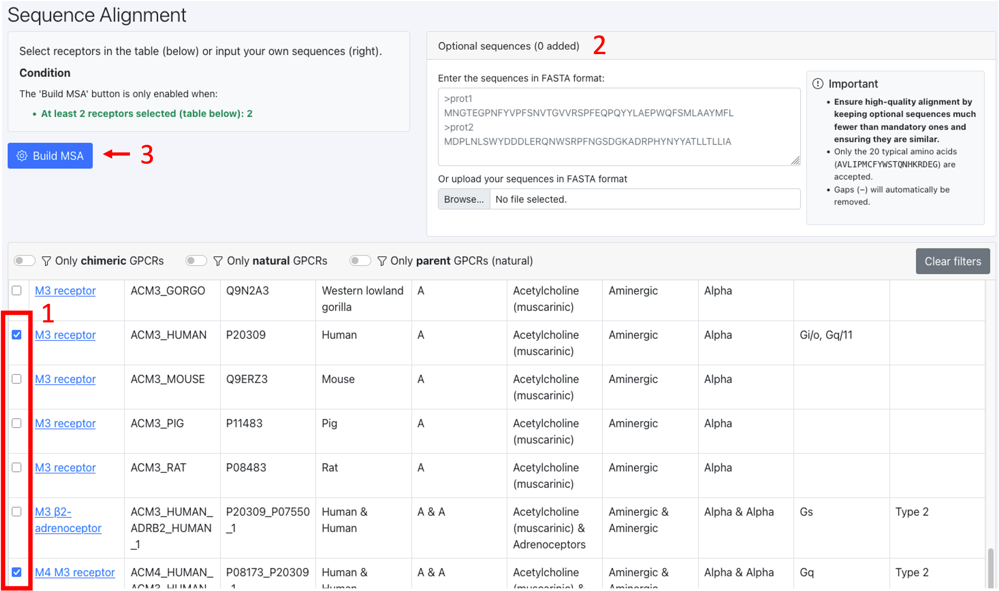

Sequence Alignment tool
=======================

Here we describe step-by-step how to compute the alignment of sequences of interest:

1. Select at least 2 sequences from the "Mandatory sequences" card using the tick boxes. In this card you find all sequences available on GPCRchimeraDB.

2. Optional: Input your own sequences in FASTA format or upload a FASTA files containing your own sequences.

**How to ensure a high-quality alignment:**
Because the mandatory sequences define the master alignment that will be used to align the optional sequences, make sure that:
    - The number of mandatory sequences is much higher than the number of optional sequences.
    - The sequence identity of the optional sequences is not too different from the sequence identity of the mandatory sequences.
As such, your master alignment will contain the required information to successfully guide the alignment of your optional sequences.

3. Click the button "Build MSA". MSA stands for Multiple Sequence Alignment.

4. On the Results page, you can either download the alignment in FASTA format or direclty analyze the alignment. You can scroll horizontally.

.. image:: images/Result_MSA.png
   :alt: Example image description
   :width: 600px

**Why do I have more sequences in my alignment than I selected to align?**
This happens if you have selected chimeric sequences in the mandatory sequences card. We noticed that the alignment of a chimera is more
accurate if both its parents are in the master alignment used to align the chimeric sequence. Therefore, the parents of a chimera automatically
gets added to the dataset to align when a chimera is selected to be aligned.