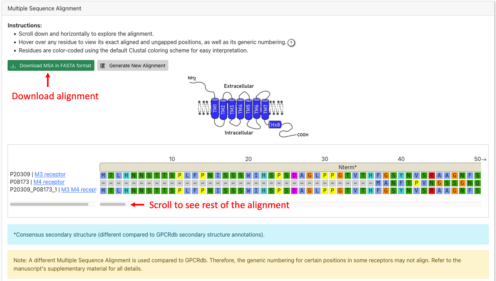

Sequence Alignment tool
=======================

Here we describe step-by-step how to compute the alignment of sequences of interest:

1. Select at least 2 sequences from the table using the tick boxes (mandatory sequences).
In this table you find all sequences available on GPCRchimeraDB.

2. Optional: Input your own sequences in FASTA format or upload a FASTA files containing your own sequences
using the card on the right.

**How to ensure a high-quality alignment:**
Ensure high-quality alignment by keeping optional sequences much fewer than mandatory ones and ensuring they are similar.
This is because the mandatory sequences defined the HMM profile that will be used to guide the alignment of the optional sequences.

3. Click the button "Build MSA". MSA stands for Multiple Sequence Alignment.

.. image:: images/MSA.png
   :alt: Example image description
   :width: 600px

4. On the Results page, you can either download the alignment in FASTA format or direclty analyze the alignment. 
You can scroll horizontally.
Hover over a residue to view its aligned and unaligned position as well as the Ballesteros-Weinstein numbering.

**Why are there more sequences in my alignment than I originally selected?**
If you selected chimeric sequences in the Mandatory Sequences card, additional sequences may have been automatically included. 
This is because aligning a chimera is more accurate when both of its parent sequences are present in the master alignment. 
To ensure optimal alignment, the parents of a chimera are automatically added to the dataset whenever a chimera is selected for alignment.