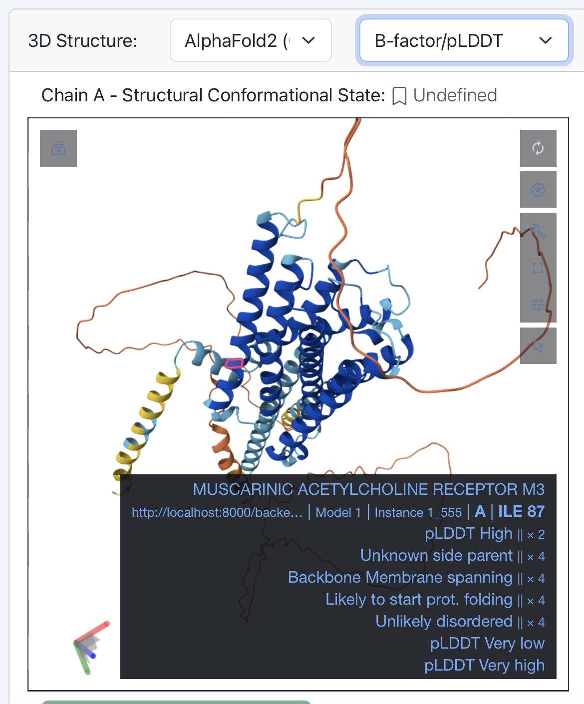

Download Data
=============

You can download the data at multiple locations on the database:

-  **The `Entries page <https://bio2byte.be/gpcrdb/>`_:**

 You can select the entry/entries you are interested in and download
    -   Their entire description (sequence, structural and biophysical level) in JSON format (1 file per selected entry).
    -   Their biophysical profile in TSV format (1 file per selected entry).

-  **The Entry page of a GPCR of interest**: At the top of the entry page of a GPCR of interest (banner), you can downlaoad:
    -   Its sequence in FASTA format.
    -   Its 3D structures or models in PDB format.
    -   Its biophysical profile in TSV format.
    -   Its entire description (sequence, structural and biophysical level) in JSON format.
    -   The entire description (sequence, structural and biophysical level) in JSON format of a residue of interest by selecting that residue in the Sequence Properties section. 

-  **GPCRchimeraDB Zenodo**: Download all info of all entries in JSON format (1 file per entry) on Zenodo. On Zenodo you can also download the Master Alignment behind the Sequence Alignment tool.

-  **GPCRchimeraDB GitHub**: Access the code used to retrieve all the information available on GPCRchimeraDB to describe the entries.
