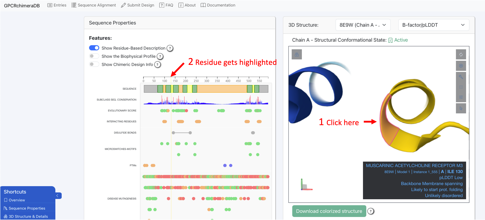
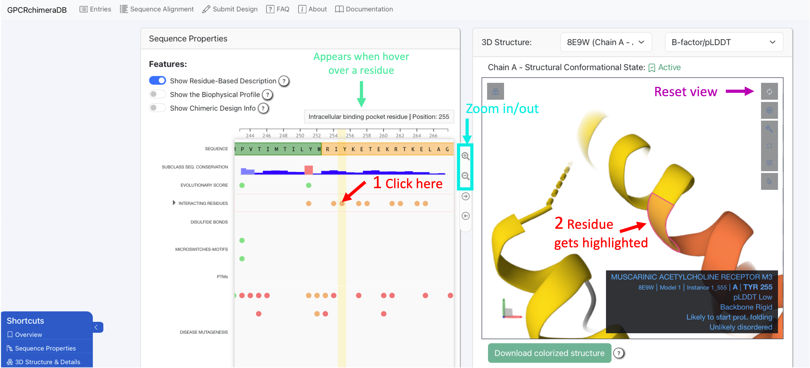
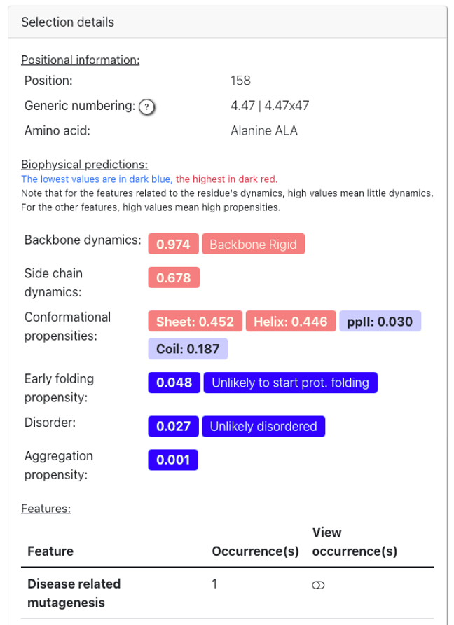

Sequence-Structure (1D-3D) viewer
==================================

The 1D-3D viewer (sequence-structure viewer) is fully interactive and interconnected. 
Clicking on a residue in the 3D structure will automatically zoom in on that residue in the sequence viewer and highlight it in yellow. 
Conversely, selecting a residue in the sequence viewer will instantly locate and zoom in on the corresponding residue in the 3D structure.

Note that in experimentally resolved structures, not all residues are always available. 
If you select an unresolved residue in the 1D viewer, it cannot be located in the 3D structure, and an error message will indicate this.
The track in the 1D viewer named after the ID of the selected 3D structure highlights which regions of the protein are unresolved in the chosen structure.

You can zoom in and out in the 1D viewer using a pinching gesture on your trackpad or by scrolling with your mouse wheel.
Additionally, when you hover over a residue, a short description appears at the top of the 1D viewer. 

To interact with the 3D molecule, you can use the following mouse controls (same as in Mol*):
    - Rotate: Click and drag with the left mouse button.
    - Translate: Click and drag with the right mouse button. On a touchpad, use a two-finger drag.
    - Zoom: Scroll with the mouse wheel. On a touchpad, pinch with two fingers.
    - Center and zoom: Right-click on the part of the structure you want to focus on.

Finally, when you select a residue in either the 1D or 3D viewer, a detailed description appears in the "Selection Details" card. 
This section provides all available information about the selected residue, along with a link to the database or web server where the data was sourced.

