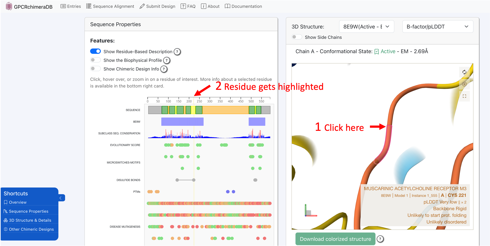
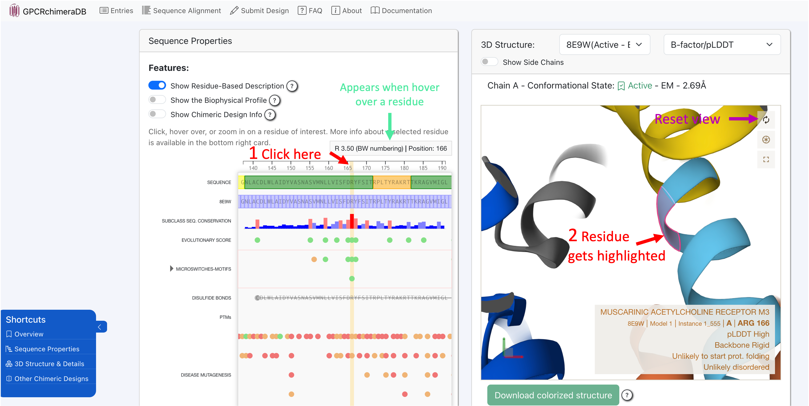

Sequence-Structure (1D-3D) viewer
==================================

The 1D-3D viwer is interactive and interconnected. This means that if you click on a residue in a 3D structure. The sequence viewer will
zoom in on that residue and highlight it in yellow. Reversely, if you click on a residue in the sequence viewer, the 3D viewer will automatically
locate the residue in the 3D structure and zoom in on it.

You can zoom in and out in the 1D viewer using the magnifier glass. Note also that a short description about the residue appears at the top of the 1D
viewer when you hover over a residue. 

Finally, when you click on a residue, either in the 1D or 3D viewer, a detailled description of the residue appears in the "Selection details"
card. There you will have all known info about the selected residue as well as the link to the database/webserver the information was extracted from.

.. image:: images/SelectionDetails.png
   :alt: Example image description
   :width: 600px
